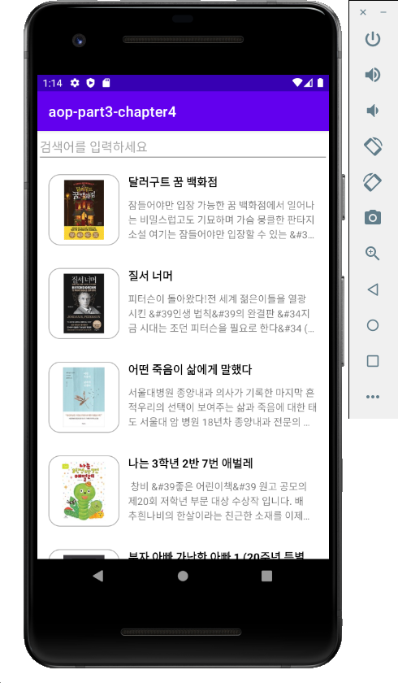
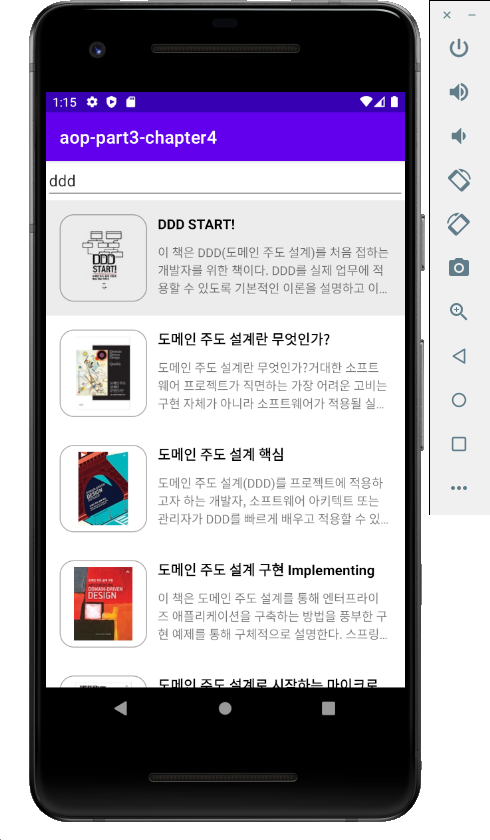

# aop-part3-chapter04 -  도서 리뷰 앱

# 목차

1. 인트로 (완성앱 & 구현 기능 소개)
2. 인터파크 도서 Open API 신청하기
3. 도서 리스트 화면 - Open API를 통해 도서 목록 가져오기
4. 도서 리스트 화면 - RecyclerView 활용하여 아이템 그려보기
5. 도서 리스트 화면 - 도서 목록 보여주기
6. 도서 검색 페이지 - 도서 검색하기
7. 도서 검색 페이지 - 검색 기록 저장하기 
8. 도서 상세 페이지 - 도서 상세 보여주기
9. 어떤 것을 추가로 개발할 수 있을까?
10. 아웃트로

# 결과화면

# 이 챕터를 통해 배우는 것

- **RecyclerView** 사용하기
- **View Binding** 사용하기
- **Retrofit** 사용하기 (API 호출)
- **Glide** 사용하기 (이미지 로딩)
- **Android Room** 사용하기 (복습 파트2, 챕터4 계산기, Local DB)
- Open API 사용해보기

### 도서 리뷰 앱

인터파크 Open API 를 통해 베스트셀러 정보를 가져와서 화면에 그릴 수 있음.

인터파크 Open API 를 통해 검색어에 해당하는 책 목록을 가져와서 화면에 그릴 수 있음.

Local DB 를 이용하여 검색 기록을 저장하고 삭제할 수 있음.

Local DB 를 이용하여 개인 리뷰를 저장할 수 있음.
